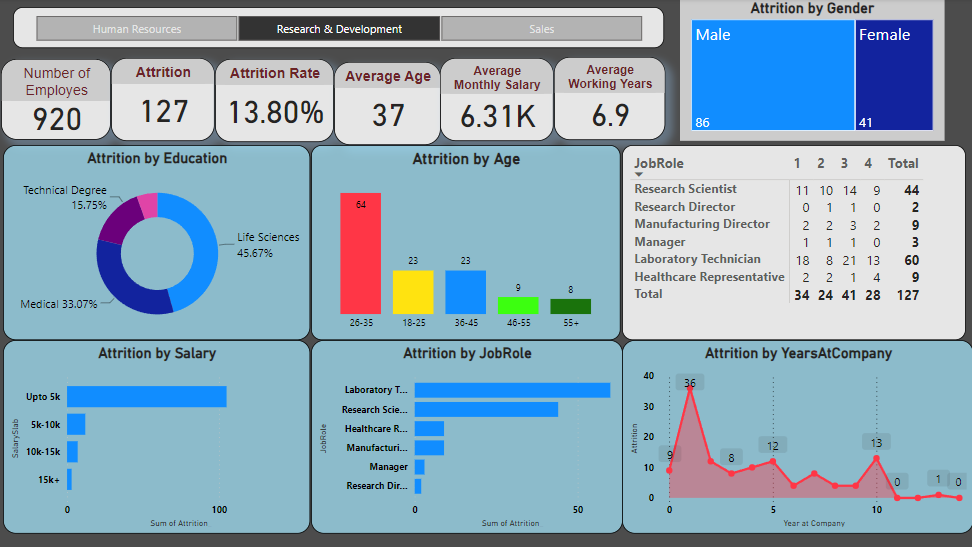
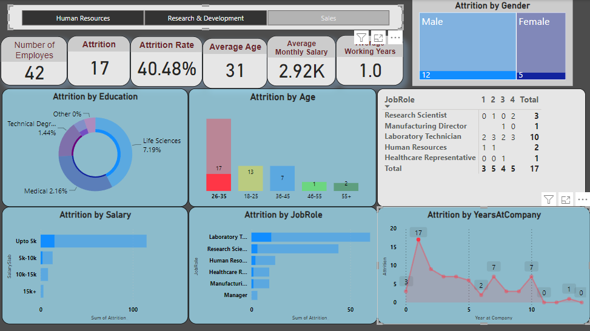
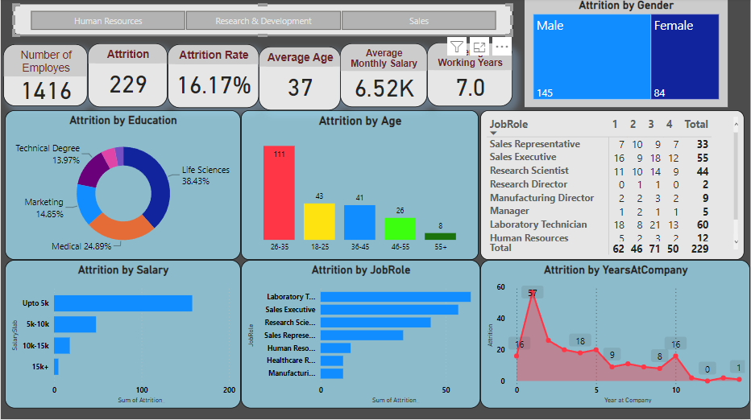

# Human Resource Data Analysis

This project analyzes employee attrition data to identify workforce patterns related to demographics, job roles, compensation, overtime, satisfaction, and tenure. It includes the raw HR dataset, a Python notebook for basic cleaning and preparation, and a Power BI dashboard for interactive analysis.

## Project Overview

Employee attrition is an important HR metric because it affects hiring cost, productivity, and workforce planning. This analysis helps explore which employee groups are more likely to leave and what factors may be associated with attrition.

The project covers:

- Employee attrition analysis by department, gender, age, job role, and overtime status
- Data cleaning and preparation using Python
- Summary grouping for selected HR dimensions
- Interactive dashboard creation in Power BI
- Visual reporting through dashboard screenshots

## Repository Structure

```text
.
+-- dashboard/
|   +-- dashboard1.pbix
|   +-- a1.png
|   +-- a2.png
|   +-- a4.png
+-- data/
|   +-- HR-Employee-Attrition.csv
+-- data_cleaning/
|   +-- HR_data.ipynb
+-- README.md
```

## Dataset

The dataset is stored at:

```text
data/HR-Employee-Attrition.csv
```

It contains 1,470 employee records with fields such as:

- Age
- Attrition
- BusinessTravel
- Department
- DistanceFromHome
- EducationField
- Gender
- JobRole
- JobSatisfaction
- MonthlyIncome
- OverTime
- PerformanceRating
- TotalWorkingYears
- YearsAtCompany
- YearsSinceLastPromotion
- YearsWithCurrManager

## Tools Used

- Python
- Jupyter Notebook
- Pandas
- Matplotlib
- Seaborn
- Microsoft Power BI

## Data Cleaning Workflow

The notebook [data_cleaning/HR_data.ipynb](data_cleaning/HR_data.ipynb) performs the initial data preparation steps:

1. Imports the HR employee attrition dataset.
2. Checks dataset columns and missing values.
3. Removes rows with missing manager-tenure values.
4. Adds a helper `count` column for grouping and aggregation.
5. Creates grouped summaries for gender and age.
6. Removes duplicate records.
7. Standardizes inconsistent `BusinessTravel` category values.
8. Exports cleaned/processed files for reporting.

> Note: The notebook currently contains local absolute file paths. If you run it on another machine, update those paths to use the relative dataset path: `data/HR-Employee-Attrition.csv`.

## Dashboard

The Power BI dashboard file is available at:

```text
dashboard/dashboard1.pbix
```

Dashboard preview:







## How to Run

1. Clone this repository:

```bash
git clone https://github.com/your-username/your-repository-name.git
```

2. Open the project folder:

```bash
cd your-repository-name
```

3. Install the required Python libraries if needed:

```bash
pip install pandas matplotlib seaborn jupyter
```

4. Open the notebook:

```bash
jupyter notebook data_cleaning/HR_data.ipynb
```

5. To view the dashboard, open `dashboard/dashboard1.pbix` in Microsoft Power BI Desktop.

## Key Insights to Explore

The dashboard and dataset can be used to explore questions such as:

- Which departments have the highest attrition?
- How does overtime relate to employee attrition?
- Which job roles are most affected by employee turnover?
- Does monthly income vary significantly between employees who stay and leave?
- How do age, tenure, and promotion history relate to attrition?

## Project Outcome

This project provides an end-to-end HR analytics workflow, from raw employee data cleaning to dashboard-based business insights. It can help HR teams better understand attrition trends and support data-driven employee retention decisions.
